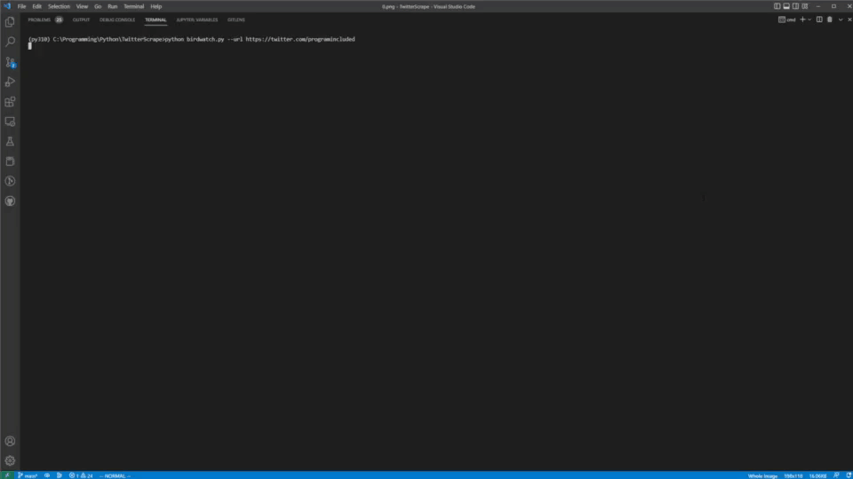

<p align="center">
    
</p>

[](https://www.gnu.org/licenses/gpl-3.0)

# Twitter Bird Watcher: A Twitter Profile Archival Tool


`TBWatcher` snapshots a profile page when given a URL (or an exported `.js` list from the official Twitter exporter.)
Supports UTF-8 text JSON files and image snapshots of each Twitter post!

This script is purely for the purposes of archival use only.



## Features

* Stores metadata in json format for each specified twitter profile.
* Neatly organizes tweets by user and takes a snapshot of each tweet.
* Marks potential tweets that are self-retweeted.
* Removes Tweet Ads.
* Allows for manual login (use at own risk.)

## Usage

```bash
# Install the requirements. Once only.
python -m pip install -r requirements.txt

# Take a snapshot from a given profile URL.
python bin/watcher.py --url www.twitter.com/<profile>

# For more help use:
python bin/watcher.py --help
```

Tested on Python 3.10.

### Output

Birdwatch generates the following in the snapshots folder:

```
└───snapshots
    └───<user_id>           # Username
        │   metadata.json   # profile metadata
        │   profile.png     # snapshot of profile page
        │
        └───tweets
                0.png       # snapshot of latest tweet
                1.png
                ...
                9.png
                tweets.json # Metadata of each screen-capped tweet.
```

### Self Boosted Tweet Detection

A self-boosted tweet is a tweet where the original author retweets.
These types of tweets are marked with `potential_boost` as true in `tweets.json`.
The script detects these by matching exact meta-datas e.g. duplicate posts.

## Schemas

Assume all data is UTF-8 compliant.

### Input File

These files are what the Twitter exporter should generate (`.js` file) from the users you are following:

```
window.* = [
    {
        "following": {
            "accountId": <id>,
            "userLink": <url>
        }
        ...
    }
]
```

You can rename as json or specify via input flags to parse the file. `window.* =` is automatically removed by the script and is default generated by Twitter. However, you can also manually remove it to parse the file as JSON directly.

### tweets.json

```
[
    {
        "id": int,
        "tag_text": str,
        "name": str,
        "handle" str,
        "timestamp": str,
        "tweet_text": str,
        "retweet_count": str,
        "like_count": str,
        "reply_count": str,
        "potential_boost":  bool
    }
]
```

Invalid string entries will be marked as "NULL".

###  metadata.json

```
{
    "bio": str,
    "name": str,
    "username": str,
    "location": str,
    "website": str,
    "join_date": str,
    "following": str,
    "followers": str
}
```

Invalid string entries will be marked as "NULL".


## Troubleshoot

* `TBWatcher` terminates early?

It is possible that your images are taking sometime to load. Consider using `-s` to adjust load-time.
Or your scrolling height is too low / too high. Consider using `--scroll-algorithm` to adjust the type of algorithm
Then passing in a value to the algorithm `--scroll-value`.

"--help" has more information as to what `--scroll-value` encodes.

## Contributing

Intrested in contributing? Take a look at our [CONTRIBUTING.md](CONTRIBUTING.md)

## Future Updates and Goals

* Support Running Multiple Sessions to Resume Per-Profile Fetching
* Save and Expand Post Attachments
